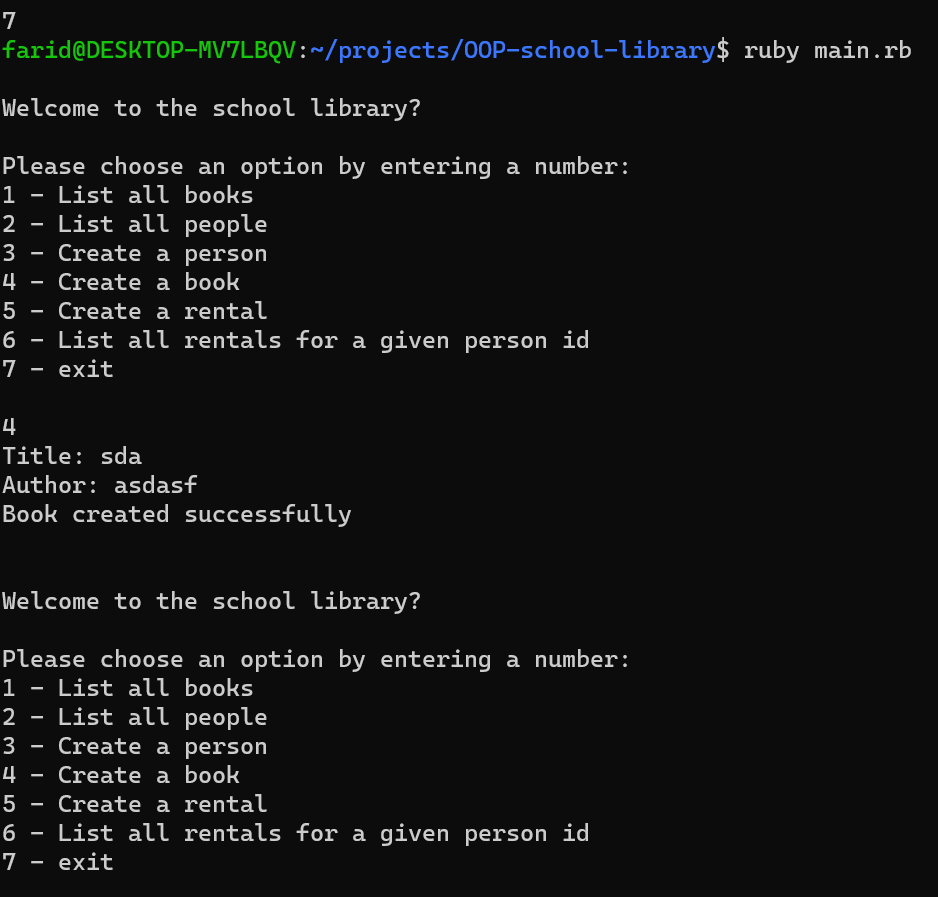

# school-library

## Description

Th app records what books are in the library and who borrows them. The app that you will create will allow, new students or teachers to be added, new books to be added,  records of who borrowed a given book and when to be saved

## Built With

- Ruby

## Deployment
[The site is deployed](https://frosty-beaver-391916.netlify.app)

## Getting Started

To get the content of this project locally you need to run this command in your terminal:

- git clone your https://github.com/matovu-farid/school-library.git
- cd project school-library
- bundle install

## Authors

👤 **Matovu Farid Nkoba**

- GitHub: [@matovu-farid](https://github.com/matovu-farid)
- Twitter: [@matovu100](https://twitter.com/matovu100)
- LinkedIn: [matovu-farid](https://www.linkedin.com/in/matovu-farid-48b80257)

## 📝 License

This project is [MIT](./MIT.md) licensed.
